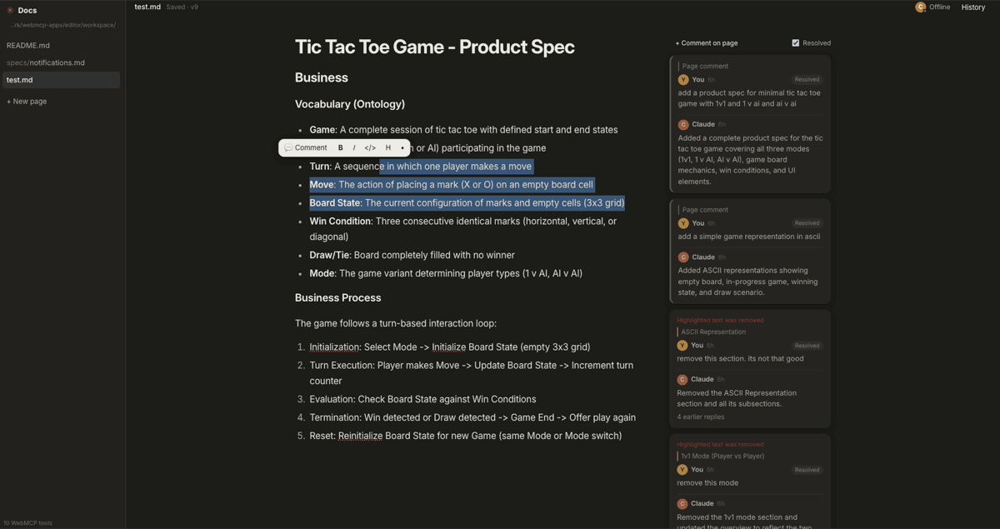
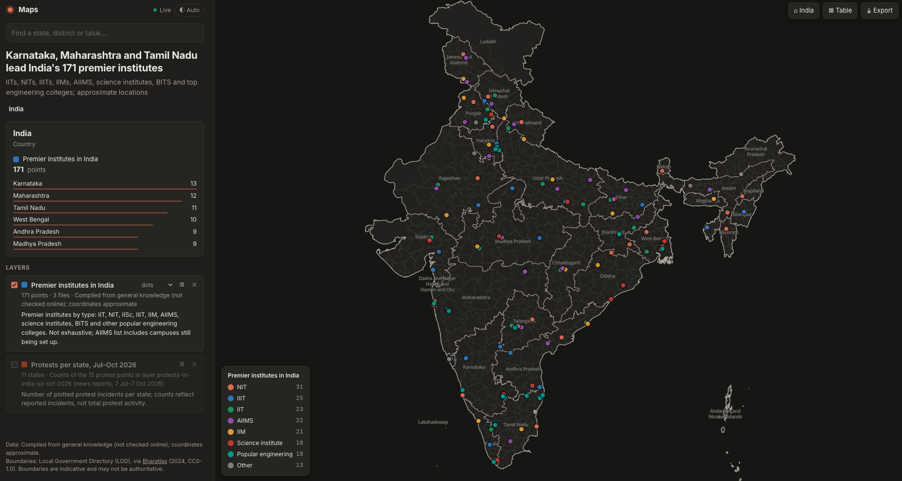

# webmcp-apps

> Let your local Claude Code interact with any WebMCP compatible frontend app.

> or just Build rich agentic experiences using WebMCP and local Claude Code.

**Your web page is the UI. Claude Code is the brain. WebMCP is the wire between them.**

A testing ground for building rich interfaces that a local Claude Code session drives through
[WebMCP](https://webmachinelearning.github.io/webmcp/). Each page registers tools with
`document.modelContext.registerTool(...)`, and Claude calls them. The pages have no backend, no API keys and no
agent SDK. See the [project page](https://smarchone.github.io/webmcp-apps).

```
claude ──MCP──► webmcp-bridge ──CDP──► Chrome tab ──► document.modelContext tools
```



**Editor.** Highlight text, leave a comment, and Claude edits the doc and replies in the thread. Every change is versioned.



**Maps.** Ask `/map plot IITs, NITs and other premium institutes in India`, and Claude researches, builds the layer and plots it across states and districts.

## Why it's worth a look

- **Any page becomes an agent surface.** Add a few tools and Claude Code can read state and take actions. You
  don't need a chat widget or a server.
- **You keep the full agent.** The session that runs your page still has files, shell and every other MCP
  server.
- **Small and dependency-free.** Plain HTML/JS plus one Node bridge. Fork it and add an app in minutes.

## The apps

| App                  | What Claude does                                                             | Port |
| -------------------- | ---------------------------------------------------------------------------- | ---- |
| [`chat/`](chat/)     | Acts as the assistant of a chat page, and manages its todos, notes and theme | 3456 |
| [`dino/`](dino/)     | Plays a dino runner from the game's physics, and learns from each death      | 3457 |
| [`editor/`](editor/) | Edits Markdown docs with you and answers your comment threads, with versions | 3458 |
| [`maps/`](maps/)     | Analyses data and plots it on India's states, districts and sub-districts    | 3459 |

## Try it (2 minutes)

Requires Node 22+ and Chrome.

```bash
cd dino && npm start      # serve the page
claude                    # in another terminal, in dino/; approve the webmcp server
> /play-dino
```

Chrome opens and Claude starts playing. The other apps work the same way: start the server in the app's
folder, run `claude` there, and use its command:

| App       | Command                                  |
| --------- | ---------------------------------------- |
| `chat/`   | `/webmcp-chat`                           |
| `editor/` | `/review-docs` or `/address-comments`    |
| `maps/`   | `/map <what to analyse>`                 |

## Build your own

1. Copy an app folder. Keep `.mcp.json`, which points at the shared bridge in `chat/bridge/`.
2. Register tools on your page:

   ```js
   await document.modelContext.registerTool({
     name: 'do_thing',
     description: 'What the agent can do here',
     inputSchema: { type: 'object', properties: {} },
     async execute(input) { return { ok: true }; },
   });
   ```

3. Add a slash command in `.claude/commands/` that tells Claude how to use them.

More detail: [`chat/README.md`](chat/README.md) covers the bridge, and
[`docs/webmcp-learnings.md`](docs/webmcp-learnings.md) has the API gotchas we hit.
